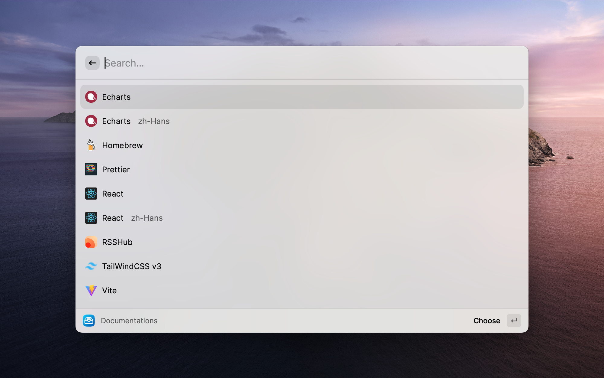

# DocSearch

Link **all DocSearch** into Raycast.



## Supported Documentations

|                   Documentations                    |                                                       |                                                              |
| :-------------------------------------------------: | :---------------------------------------------------: | :----------------------------------------------------------: |
|    [Apollo](https://www.apollographql.com/docs)     |         [Arthas](https://arthas.aliyun.com/)          |            [Bootstrap](https://getbootstrap.com/)            |
|             [Clerk](https://clerk.dev)              |          [Dubbo](https://dubbo.apache.org/)           | [Echarts(zh-Hans)](https://echarts.apache.org/zh/index.html) |
| [Echarts](https://echarts.apache.org/en/index.html) |               [Flet](https://flet.dev/)               |             [GitBook](https://docs.gitbook.com/)             |
|            [Homebrew](https://brew.sh/)             |            [IPFS](https://docs.ipfs.tech/)            |             [Laravel 9.x](https://laravel.com/)              |
|             [Nuxt](https://nuxtjs.org/)             |            [Nuxt3](https://v3.nuxtjs.org/)            |               [Prettier](https://prettier.io/)               |
|         [RSSHub](https://docs.rsshub.app/)          |      [Raycast](https://developers.raycast.com/)       |        [React(zh-Hans)](https://zh-hans.reactjs.org/)        |
|            [React](https://reactjs.org/)            | [React Bootstrap](https://react-bootstrap.github.io/) |           [React Native](https://reactnative.dev/)           |
|             [Remix](https://remix.run/)             |        [Slidev(zh-Hans)](https://cn.sli.dev/)         |                  [Slidev](https://sli.dev/)                  |
|        [Supabase](https://supabase.com/docs)        |      [TailwindCSS v3](https://tailwindcss.com/)       |               [Unidata](https://unidata.app/)                |
|       [Vite(zh-Hans)](https://cn.vitejs.dev/)       |              [Vite](https://vitejs.dev/)              |                [Vitest](https://vitest.dev/)                 |
|      [Vue Router4](https://router.vuejs.org/)       |          [Vue3(zh-Hans)](https://vuejs.org/)          |                  [Vue3](https://vuejs.org/)                  |
|            [VueUse](https://vueuse.org/)            |      [Vuepress v1](https://vuepress.vuejs.org/)       |        [Vuepress v2](https://v2.vuepress.vuejs.org/)         |
|         [pnpm(zh-Hans)](https://pnpm.io/zh)         |              [pnpm](https://pnpm.io/zh)               |

## Install

1. Raycast Store  
   <a title="Install DocSearch Raycast Extension" href="https://www.raycast.com/Fatpandac/docsearch#install">
   
   </a>
2. Manual Install or Develop
   - Download the repo by `git clone`
   - Install dependence by `npm install`
   - Run by `npm run dev`

## Add Other Documentation

1. The documentation site is supported [DocSearch](https://docsearch.camunda.com/).
2. Open developer tools and input something in the search bar.
   
3. Download the site icon and put it into [assets/logo](assets/logo).
4. Input DocSearch data into [apiData.ts](/src/algolia/apiData.ts), like below.
   ```ts
   {
        name: 'Vuepress v1',
        icon: '../assets/logo/XXXX.png',  // path to icon in the assets folder
        apiKey: '3a539aab83105f01761a137c61004d85',
        appID: 'BH4D9OD16A',
        indexName: 'vuepress',
        homepage: 'https://vuepress.vuejs.org/',
   }
   ```
5. Create an entrance.

   - Create a tsx file in the root of src.
   - Write the code into it, like below:

     ```tsx
     import { SearchDocumentation } from "./components";

     export default function Command(props: { arguments: { search?: string } }) {
       // The docsName value must same as you write the name in the apiData
       return <SearchDocumentation docsName="Vuepress v1" quickSearch={props.arguments?.search} />;
     }
     ```

   - Finally, write some code to the properties of commands in the [package.json](/package.json)
     ```json
     ...
        "commands": [
           {
              "name": "vuepress1",  // The name of the file you created
              "title": "Search Documentation",
              "subtitle": "Vuepress v1",
              "description": "Search Vuepress v1 documentation",
              "arguments": [
                 {
                    "name": "search",
                    "placeholder": "Search...",
                    "type": "text"
                 }
              ],
              "mode": "view"
           },
           ...
        ]
     ...
     ```

6. Enjoy! Welcome to contribute.
