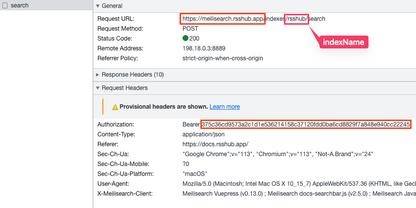

# DocSearch

Link **DocSearch** and **Meilisearch** into Raycast.


### Supported Documentations (53 documentations | 91 different versions)

|               Documentations               |                                                   |                                                       |
| :----------------------------------------: | :-----------------------------------------------: | :---------------------------------------------------: |
|        [Antd](https://ant.design/)         | [Antdv](https://antdv.com/components/overview-cn) |     [Apollo](https://www.apollographql.com/docs)      |
|    [Arthas](https://arthas.aliyun.com/)    |        [Astro](https://docs.astro.build/)         |        [Bootstrap](https://getbootstrap.com/)         |
|         [Clerk](https://clerk.dev)         |        [Dubbo](https://dubbo.apache.org/)         |  [Echarts](https://echarts.apache.org/en/index.html)  |
|         [Flet](https://flet.dev/)          |       [GitBook](https://docs.gitbook.com/)        |             [Homebrew](https://brew.sh/)              |
|      [IPFS](https://docs.ipfs.tech/)       |          [Laravel](https://laravel.com/)          |            [Nuxt](https://v3.nuxtjs.org/)             |
|       [NvChad](https://nvchad.com/)        |            [Pnpm](https://pnpm.io/zh)             |           [Prettier](https://prettier.io/)            |
| [Raycast](https://developers.raycast.com/) |           [React](https://reactjs.org/)           | [React Bootstrap](https://react-bootstrap.github.io/) |
|  [React Native](https://reactnative.dev/)  |            [Remix](https://remix.run/)            |              [Slidev](https://sli.dev/)               |
|  [Taro](https://docs.taro.zone/docs/4.x/)  |       [Supabase](https://supabase.com/docs)       |        [TailwindCSS](https://tailwindcss.com/)        |
|        [Tauri](https://tauri.app/)         |          [Unidata](https://unidata.app/)          |              [Vite](https://vitejs.dev/)              |
|       [Vitest](https://vitest.dev/)        |      [Vue Router](https://router.vuejs.org/)      |               [Vue](https://vuejs.org/)               |
|       [VueUse](https://vueuse.org/)        |    [Vuepress](https://v2.vuepress.vuejs.org/)     |    [ElementPlus](https://element-plus.org/en-US/)     |
|        [Neovim](https://neovim.io/)        |           [Less](https://lesscss.org/)            |            [Sass](https://sass-lang.com/)             |
|         [Deno](https://deno.com/)          |   [TypeScript](https://www.typescriptlang.org)    |           [NextJS](https://nextjs.org/docs)           |
|   [MassTransit](https://masstransit.io/)   |         [Pinia](https://pinia.vuejs.org/)         |          [Yazi](https://yazi-rs.github.io/)           |
|     [Ollama](https://docs.ollama.com/)     |           [Homarr](https://homarr.dev/)           |           [Rsdoctor](https://rsdoctor.rs/)            |
|       [Rsbuild](https://rsbuild.rs/)       |           [Rspack](https://rspack.rs/)            |              [Rslib](https://rslib.rs/)               |
|        [Rstest](https://rstest.rs/)        |        [Tailscale](https://tailscale.com/)        |

### Docsearch

1. The documentation site is supported [DocSearch](https://docsearch.camunda.com/).
2. Open developer tools and input something in the search bar.
   
3. Download the site icon and put it into [assets/logo](assets/logo).
4. Create a new file in [data/docs](/src/data/docs) folder, like [vuepress.ts](/src/data/docs/vuepress.ts) and input DocSearch data into it, like below.

   ```ts
   import { DocItem } from "../types";

   const vuepress: DocItem = {
     // write a tag name for this documentation version that combines both the version and the language
     "V1 zh-CN": {
       icon: "../assets/logo/XXXX.png", // path to icon in the assets folder
       apiKey: "3a539aab83105f01761a137c61004d85",
       appID: "BH4D9OD16A",
       indexName: "vuepress",
       type: "algolia",
       homepage: "https://vuepress.vuejs.org/",
       /**
        * Optional fields
        * formatter: (item: Array<any>) => FormatResult; // function to format the search result item
        */
     },
   };

   export default vuepress;
   ```

5. Import and register it in [apis.ts](/src/data/apis.ts).
6. Run the command `npm run generate`. This will create the entry file and config. After that, you can run the command `npm run dev` to test it, and `npm run build` to build it.

### Meilisearch

1. The documentation site is supported [Meilisearch](https://www.meilisearch.com/).
2. Open developer tools and input something in the search bar.
   
3. Download the site icon and put it into [assets/logo](assets/logo).
4. Create a new file in [data/docs](/src/data/docs) folder, like [rsshub.ts](/src/data/docs/rsshub.ts) and input DocSearch data into it, like below.

   ```ts
   import { DocItem } from "../types";

   const rsshub: DocItem = {
     // write a tag name for this documentation version that combines both the version and the language
     "en-US": {
       icon: "../assets/logo/rsshub.png", // path to icon in the assets folder
       apikey: "3a539aab83105f01761a137c61004d85",
       appid: "bh4d9od16a",
       indexname: "vuepress",
       type: "meilisearch",
       homepage: "https://vuepress.vuejs.org/",
       /**
        * Optional fields
        * formatter: (item: Array<any>) => FormatResult; // function to format the search result item
        */
     },
   };

   export default rsshub;
   ```

5. Import and register it in [apis.ts](/src/data/apis.ts).
6. Run the command `npm run generate`. This will create the entry file and config. After that, you can run the command `npm run dev` to test it, and `npm run build` to build it.

### Trieve

1. The documentation site is supported [Trieve](https://trieve.ai/).
2. Open developer tools and input something in the search bar.
   
3. Download the site icon and put it into [assets/logo](assets/logo).
4. Create a new file in [data/docs](/src/data/docs) folder, like [rsshub.ts](/src/data/docs/rsshub.ts) and input DocSearch data into it, like below.

   ```ts
   import { DocItem } from "../types";

   const config: DocItem = {
     // write a tag name for this documentation version that combines both the version and the language
     "en-US": {
       icon: "../assets/logo/ollama.png",
       apiKey: "tr-T6JLeTkFXeNbNPyhijtI9XhIncydQQ3O", // Authorization
       datasetId: "61d88682-c9e5-4b83-8a6e-0b01280b26de", // Tr-Dataset
       type: "trieve",
       homepage: "https://docs.ollama.com/",
       baseUrl: "https://api.mintlifytrieve.com",
       searchType: "fulltext",
       /**
        * Optional fields
        * formatter: (item: Array<NewScoreChunk>) => FormatResult; // function to format the search result item
        */
     },
   };

   export default config;
   ```

5. Import and register it in [apis.ts](/src/data/apis.ts).
6. Run the command `npm run generate`. This will create the entry file and config. After that, you can run the command `npm run dev` to test it, and `npm run build` to build it.

**Enjoy! Welcome to contribute.**
